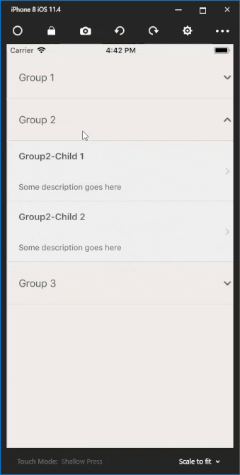
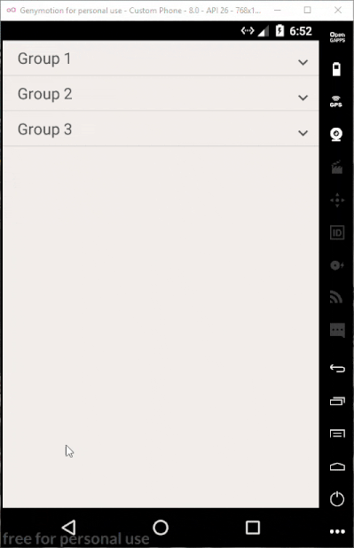

# SharedSpace
A Xamarin Forms expandable list for iOS &amp; Android, providing a single group to be expanded at a time..    

ioS [](https://appcenter.ms)  Droid [](https://appcenter.ms)

This is also available as a nuget package in (https://www.nuget.org/packages/SharedSpace.ExpandableList/).  

--- 

The aim of this project is to create a cross-platform expandable list which is easier to use and saves developer time. Inspired by the work of [Jay Shukla](https://github.com/shuklajay/CollapseListView-in-xamarin.forms) SharedSpace offers custom data-binding with your underlying collection object to be displayed in the list. Please refer to [Usage](#usage) for more details.   

      

---
<a name="usage"></a>
# Usage  

In your XAML add a reference to ***SharedSpace.CustomControls***.    
Set the bindable attributes ***Items*** & ***ChildSelectedCommand***. For a full list bindable attributes check out [here](#attributes).  
The values for these must be available in your view model. The following is an example XAML  

```
<?xml version="1.0" encoding="utf-8" ?>
<ContentPage xmlns="http://xamarin.com/schemas/2014/forms"
             xmlns:x="http://schemas.microsoft.com/winfx/2009/xaml"
             xmlns:customControls="clr-namespace:SharedSpace.CustomControls;assembly=SharedSpace"
             x:Class="Example.SharedSpace.Common.Features.MainPage"
             
             BackgroundColor="{StaticResource BackgroundColor}">
  <ContentPage.Content>
    <StackLayout Spacing="0">
      <customControls:MultiLevelListView Items="{Binding ListItems}" ChildSelectedCommand="{Binding ItemSelected}" VerticalOptions="FillAndExpand" HorizontalOptions="FillAndExpand"/>
    </StackLayout>
  </ContentPage.Content>
</ContentPage>
```  


In your view model, add a reference to *SharedSpace.DomainObjects*.   
Create a property of type *ExpandableListCollection* and set this as the data binding context for *Item* property in XAML.  
Create a Command property and set this as the binding context for *ChildSelectedCommand* in XAML.  
Following is an example view model with these settings.   
```csharp
public ExpandableListCollection ListItems { get => _listItems; set { _listItems = value; RaisePropertyChanged("ListItems"); } }

public Command ItemSelected => new Command(async (selectedItem) =>
{
  // Describe your logic here when hit on a List item
  var item = selectedItem as ExpandableListItem;
  await App.Current.MainPage.DisplayAlert("You selected an item", item.Name, "Cancel");
});
```  

In your **Android** project add a reference to *SharedSpace.Droid.Lib*.  
In your MainActivity OnCreate method add the following. (import *SharedSpace.Droid.Lib*)   
```csharp 
ExpandableListViewRenderer.Init();
```  

As for **iOS** add a reference to *SharedSpace.iOS.Lib*.  
In your AppDelegate FinishedLaunching method add the following.  
```csharp 
ExpandableListViewRenderer.Init();
```  

That's all folks :) 

Please check out the example Droid & iOS projects as a guide. 

<a name="attributes"></a>
# Bindable Attributes  
- Items
- ChildSelectedCommand
- GroupBackColor (Either in 6 digit or 8 digit hex format- #aabbcc or #ffaabbcc)
- ChildBackColor (Either in 6 digit or 8 digit hex format- #aabbcc or #ffaabbcc)
